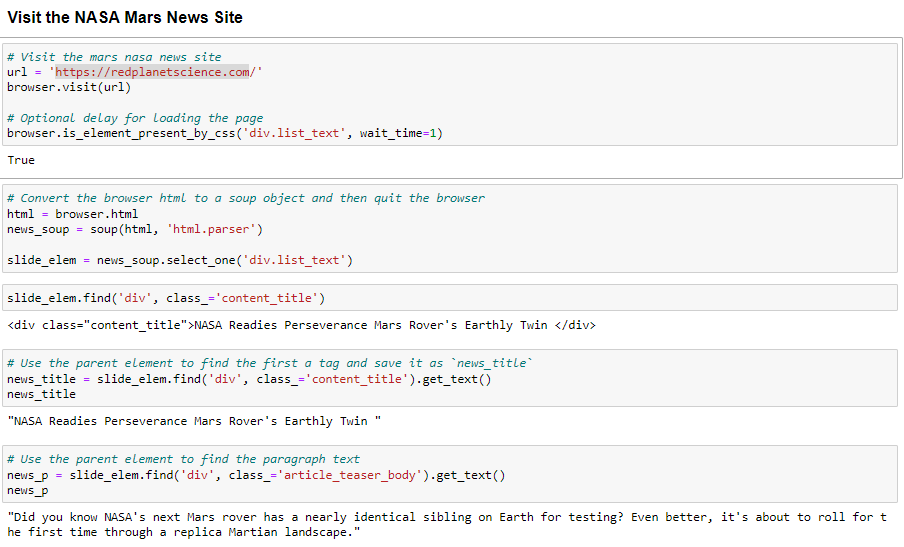
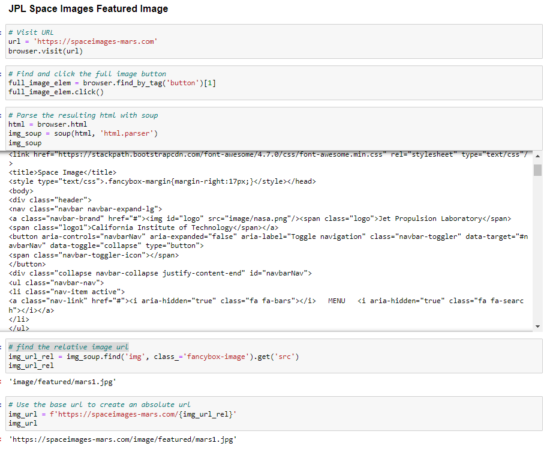
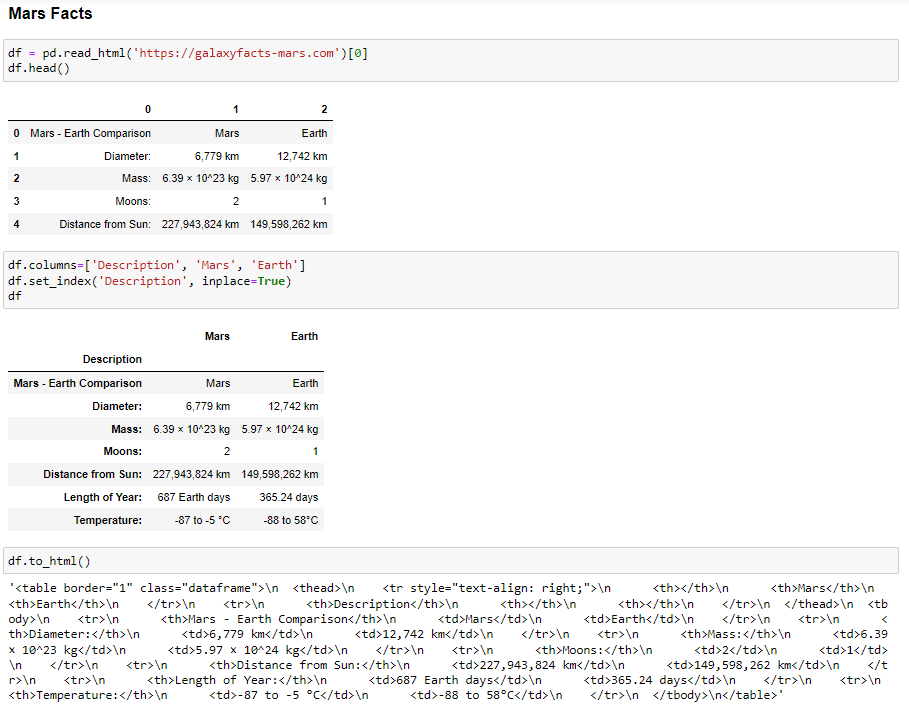
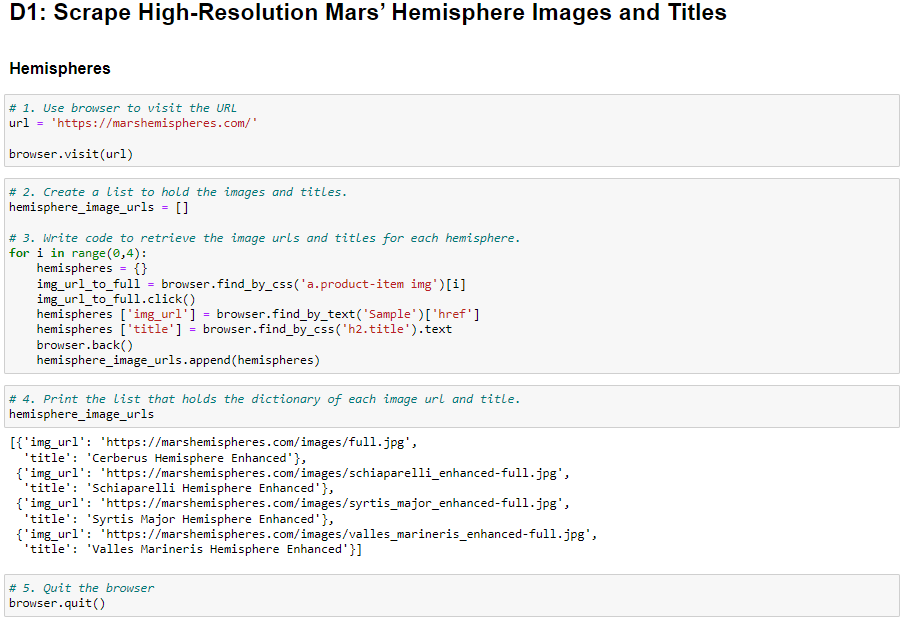
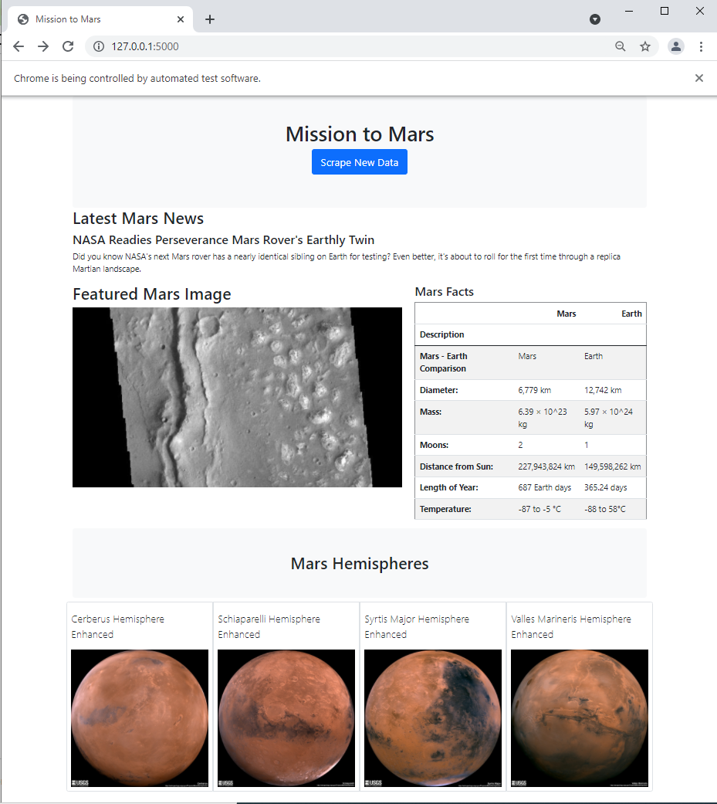

# Mission-to-Mars

## Overview of the project

The purpose of this project is to gather data about Mission to Mars from all over the web, and display it in the central location with web-application that scrape new data with a click of the button.

## Results

1. First in Jupyter Notebook I gathered the News title and article from [the Mars News Website](https://redplanetscience.com)

   

2. Then I scraped the featured image from [https://spaceimages-mars.com](https://spaceimages-mars.com)

   

3. Gathered the Mars facts from [https://galaxyfacts-mars.com](https://galaxyfacts-mars.com) 

   

4. And scraped high-resolution Mars' hemisphere images and titles form [https://marshemispheres.com](https://marshemispheres.com)

   

5. In my [scraping.py](scraping.py) file created functions that collect mars data with a click of the button.
6. In my [app.py](app.py) file saved all the collected data to my mongoDB
7. With my [index.html file](./templates/index.html) created a webpage that displays all the collected data and customized it to be mobile-responsive.

## Summary

The application is able to scrape  required data, store it in MongoDB, display it on a webpage and refresh the data with a click of the button. The web page is mobile-responsive.

